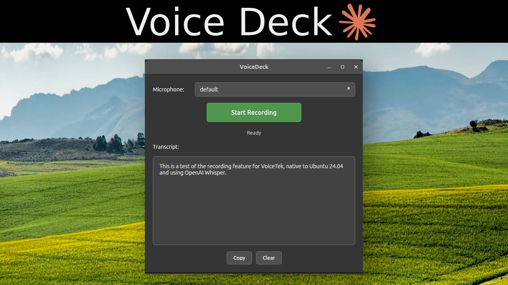

# VoiceDeck

[](https://claude.ai/code)


A desktop voice recorder with speech-to-text transcription for Ubuntu. Record from any microphone, click stop, and get your transcript. Uses OpenAI's Speech-to-Text API with support for recordings up to 60 minutes.

<p align="center">
  
</p>

## Features

- **Simple workflow**: Select mic, click record, click stop, get transcript
- **Long recording support**: Handles 30-60 minute recordings via automatic chunking
- **Secure API key storage**: Your API key is encrypted in your system's keyring
- **Built-in settings**: Configure everything in the app - no config files needed
- **Dark themed UI**: Modern, minimal interface
- **Keyboard shortcuts**: Customizable hotkeys (default: Ctrl+Space to record)
- **Clipboard integration**: One-click copy of transcripts

---

## Quick Start (Ubuntu)

### Step 1: Download and Install

Download the `.deb` file from the [Releases](https://github.com/yourusername/voicedeck/releases) page, then install:

```bash
sudo apt install ./voicedeck_1.0.0_amd64.deb
```

Or double-click the `.deb` file to open it in Ubuntu Software.

### Step 2: Get an OpenAI API Key

1. Go to [platform.openai.com](https://platform.openai.com)
2. Sign up or log in
3. Go to **API Keys** in the left sidebar
4. Click **Create new secret key**
5. Copy the key (starts with `sk-`)

### Step 3: Launch and Configure

1. Open **VoiceDeck** from your Applications menu
2. Click **Settings** (top right)
3. Paste your API key in the **API Key** field
4. Click **Save**

That's it! Your API key is stored securely in your system keyring.

### Step 4: Record and Transcribe

1. Select your microphone from the dropdown
2. Click **Start Recording** (or press `Ctrl+Space`)
3. Speak...
4. Click **Stop Recording** (or press `Ctrl+Space` again)
5. Wait for transcription
6. Click **Copy** to copy the text

---

## Settings

Click the **Settings** button to configure:

**API Tab:**
- OpenAI API Key (stored securely)
- Model selection (whisper-1, gpt-4o-transcribe, etc.)
- Base URL (for Azure or custom endpoints)

**Audio Tab:**
- Sample rate
- Mono/Stereo recording
- Auto-delete recordings after transcription

**Shortcuts Tab:**
- Toggle recording hotkey
- Copy transcript hotkey

---

## Building from Source

For developers who want to build from source:

```bash
# Install system dependencies
sudo apt install python3 python3-pip python3-venv libportaudio2

# Clone and setup
git clone https://github.com/yourusername/voicedeck.git
cd voicedeck
python3 -m venv venv
source venv/bin/activate
pip install -e .

# Run
python -m voicedeck.main
```

### Building the .deb Package

```bash
pip install pyinstaller
./scripts/build_binary.sh
./scripts/build_deb.sh
```

Output: `dist/voicedeck_1.0.0_amd64.deb`

---

## Troubleshooting

**App won't start after install?**
Try running `voicedeck` from a terminal to see error messages.

**No microphones listed?**
Make sure your microphone is connected and PulseAudio/PipeWire is running.

**"API Key Required" error?**
Click Settings and enter your OpenAI API key.

**Transcription fails?**
- Check your internet connection
- Verify your API key is valid at [platform.openai.com](https://platform.openai.com)
- Make sure you have API credits

**Very long recordings taking forever?**
Long recordings (30+ minutes) are split into chunks and transcribed sequentially. This can take a few minutes.

---

## Uninstall

```bash
sudo apt remove voicedeck
```

---

## License

MIT License
