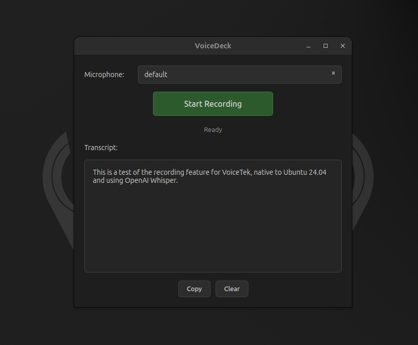

# VoiceDeck


A desktop voice recorder with speech-to-text transcription for Ubuntu. Record from any microphone, click stop, and get your transcript. Uses OpenAI's Speech-to-Text API with support for recordings up to 60 minutes.

<p align="center">
  
</p>

## Features

- **Simple workflow**: Select mic, click record, click stop, get transcript
- **Long recording support**: Handles 30-60 minute recordings via automatic chunking
- **Incremental recording**: Audio streams directly to disk, no RAM limits
- **Dark themed UI**: Modern, minimal interface
- **Keyboard shortcut**: Ctrl+Space toggles recording
- **Clipboard integration**: One-click copy of transcripts
- **Configurable backend**: Default OpenAI API, extensible for other providers

## Installation

### System Dependencies

```bash
sudo apt update
sudo apt install -y python3 python3-pip python3-venv \
    libportaudio2 libasound2 ffmpeg
```

### From Source (Development)

```bash
# Clone the repository
git clone https://github.com/yourusername/voicedeck.git
cd voicedeck

# Create and activate virtual environment
python3 -m venv venv
source venv/bin/activate

# Install dependencies
pip install -e .

# Run the application
python -m voicedeck.main
```

### From .deb Package

```bash
# Download or build the .deb file (see Building section)
sudo apt install ./voicedeck_1.0.0_amd64.deb
```

After installation, launch VoiceDeck from your application menu or run `voicedeck` from terminal.

## Configuration

### API Key (Required)

Set your OpenAI API key via environment variable:

```bash
export OPENAI_API_KEY="your-api-key-here"
```

Or add it to your shell profile (`~/.bashrc` or `~/.profile`):

```bash
echo 'export OPENAI_API_KEY="your-api-key-here"' >> ~/.bashrc
source ~/.bashrc
```

### Configuration File (Optional)

Create a config file at one of these locations:
- `~/.config/voicedeck/config.toml`
- `~/.voicedeck.toml`
- `./config.toml` (current directory)

See `config.example.toml` for all options:

```toml
[stt]
provider = "openai"
model = "whisper-1"
# base_url = "https://your-endpoint/v1"  # For Azure or compatible APIs
max_chunk_seconds = 600
max_chunk_mb = 24

[audio]
sample_rate = 16000
channels = 1

cleanup_audio_after_transcription = true
```

### Environment Variables

| Variable | Description |
|----------|-------------|
| `OPENAI_API_KEY` | OpenAI API key (required) |
| `OPENAI_BASE_URL` | Custom API endpoint (optional) |
| `VOICEDECK_STT_MODEL` | Override STT model |
| `VOICEDECK_STT_PROVIDER` | Override provider |

## Usage

1. **Launch** VoiceDeck from your applications menu or terminal
2. **Select** your microphone from the dropdown
3. **Click** "Start Recording" or press `Ctrl+Space`
4. **Speak** - audio records to disk incrementally
5. **Click** "Stop Recording" or press `Ctrl+Space` again
6. **Wait** for transcription (status shows "Transcribing...")
7. **Copy** the transcript with the Copy button or `Ctrl+Shift+C`
8. **Clear** to reset and record again

### Keyboard Shortcuts

| Shortcut | Action |
|----------|--------|
| `Ctrl+Space` | Toggle recording |
| `Ctrl+Shift+C` | Copy transcript |

## Building

### Build Standalone Binary

```bash
# Install build dependencies
pip install pyinstaller

# Build binary
./scripts/build_binary.sh
```

Output: `dist/VoiceDeck/VoiceDeck`

### Build .deb Package

```bash
# First build the binary
./scripts/build_binary.sh

# Then build the .deb
./scripts/build_deb.sh
```

Output: `dist/voicedeck_1.0.0_amd64.deb`

Install with:
```bash
sudo apt install ./dist/voicedeck_1.0.0_amd64.deb
```

## Extending STT Backends

The transcription backend is abstracted via the `Transcriber` interface in `voicedeck/stt/base.py`. To add a new backend:

1. Create a new file in `voicedeck/stt/` (e.g., `local_whisper.py`)
2. Implement the `Transcriber` interface
3. Update `create_transcriber()` in `openai_client.py` to handle your provider
4. Set `provider = "your_provider"` in config

## File Locations

| Path | Purpose |
|------|---------|
| `~/.cache/voicedeck/` | Temporary audio files |
| `~/.config/voicedeck/config.toml` | User configuration |
| `/opt/voicedeck/` | Installed binary (from .deb) |

## Troubleshooting

**No microphones listed**: Check that PulseAudio/PipeWire is running and your microphone is connected.

**Permission denied**: Ensure your user is in the `audio` group: `sudo usermod -aG audio $USER` (log out and back in).

**API errors**: Verify your `OPENAI_API_KEY` is set and valid. Check network connectivity.

**Transcription timeout**: For very long recordings, transcription may take several minutes. The app remains responsive during this time.

## License

MIT License
