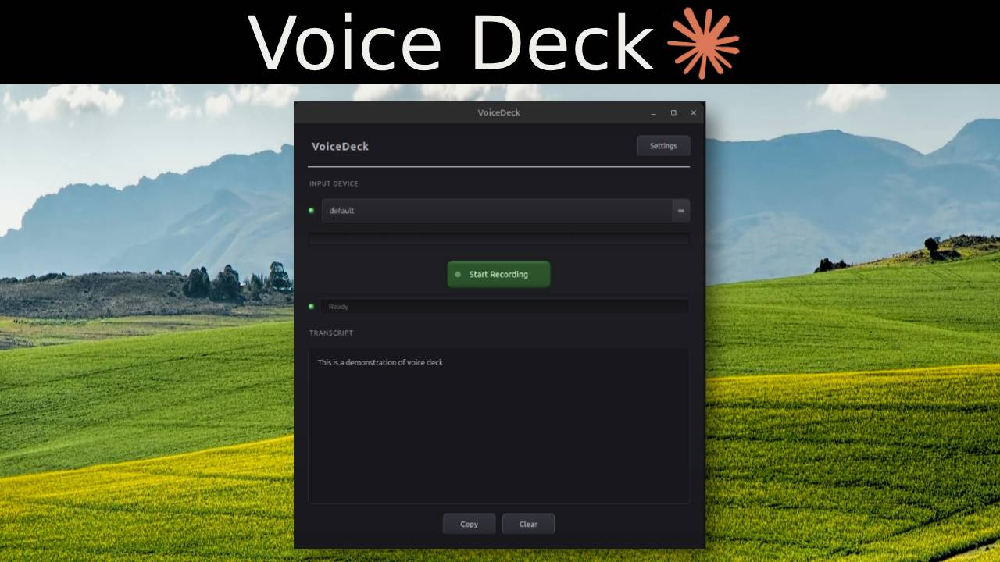

# VoiceDeck

[](https://claude.ai/code)


A desktop voice recorder with speech-to-text transcription for Linux, macOS, and Windows. Record from any microphone, click stop, and get your transcript. Uses OpenAI's Speech-to-Text API with support for recordings up to 60 minutes.

The simplest and cheapest way to talk to AI coding agents. Speak your thoughts into VoiceDeck, copy the transcript, and paste it straight into your terminal — Claude Code, Cursor, Aider, or whatever you're using. No fancy integrations to set up, no subscriptions beyond your existing API key. Just record, copy, paste.

<p align="center">
  
</p>

## Features

- **Simple workflow**: Select mic, click record, click stop, get transcript
- **Long recording support**: Handles 30-60 minute recordings via automatic chunking
- **Background recording**: Keep recording while using other apps — audio capture runs independently of window focus
- **Secure API key storage**: Your API key is encrypted in your system's keyring
- **Built-in settings**: Configure everything in the app — no config files needed
- **Dark themed UI**: Modern, minimal interface
- **Keyboard shortcuts**: Customizable hotkeys (default: Ctrl+Space to record)
- **Clipboard integration**: One-click copy of transcripts
- **Cross-platform**: Same experience on Linux, macOS, and Windows

---

## Quick Start

### Linux

Download the `.deb` file from the [Releases](https://github.com/RomanSlack/VoiceDeck/releases) page, then install:

```bash
sudo apt install ./voicedeck_1.0.0_amd64.deb
```

Or double-click the `.deb` file to open it in Ubuntu Software.

### macOS

Download `VoiceDeck_1.0.0.dmg` from [Releases](https://github.com/RomanSlack/VoiceDeck/releases), open it, and drag **VoiceDeck** to your **Applications** folder. Launch from Spotlight or the Applications folder.

> On first launch, macOS will ask for microphone permission — click **Allow**.
> If you see a Gatekeeper warning ("app from unidentified developer"), go to **System Settings > Privacy & Security** and click **Open Anyway**.

### Windows

Download `VoiceDeck_Setup_1.0.0.exe` from [Releases](https://github.com/RomanSlack/VoiceDeck/releases) and run the installer. VoiceDeck will appear in your Start Menu.

> If Windows SmartScreen shows a warning, click **More info** then **Run anyway**.

---

### Get an OpenAI API Key

1. Go to [platform.openai.com](https://platform.openai.com)
2. Sign up or log in
3. Go to **API Keys** in the left sidebar
4. Click **Create new secret key**
5. Copy the key (starts with `sk-`)

### Launch and Configure

1. Open **VoiceDeck** from your app launcher (Applications menu / Spotlight / Start Menu)
2. Click **Settings** (top right)
3. Paste your API key in the **API Key** field
4. Click **Save**

That's it! Your API key is stored securely in your system keyring.

### Record and Transcribe

1. Select your microphone from the dropdown
2. Click **Start Recording** (or press `Ctrl+Space`)
3. Speak...
4. Click **Stop Recording** (or press `Ctrl+Space` again)
5. Wait for transcription
6. Click **Copy** to copy the text

---

## Settings

Click the **Settings** button to configure:

**API Tab:**
- OpenAI API Key (stored securely)
- Model selection (whisper-1, gpt-4o-transcribe, etc.)
- Base URL (for Azure or custom endpoints)

**Audio Tab:**
- Sample rate
- Mono/Stereo recording
- Auto-delete recordings after transcription

**Shortcuts Tab:**
- Toggle recording hotkey
- Copy transcript hotkey

---

## Building from Source

### Linux

```bash
# Install system dependencies
sudo apt install python3 python3-pip python3-venv libportaudio2

# Clone and setup
git clone https://github.com/RomanSlack/VoiceDeck.git
cd VoiceDeck
python3 -m venv venv
source venv/bin/activate
pip install -e .

# Run
python -m voicedeck.main
```

### macOS

```bash
# Install system dependencies
brew install portaudio

# Clone and setup
git clone https://github.com/RomanSlack/VoiceDeck.git
cd VoiceDeck
python3 -m venv venv
source venv/bin/activate
pip install -e .

# Run
python -m voicedeck.main
```

### Windows

```powershell
# Clone and setup (Python 3.10+ required — download from python.org)
git clone https://github.com/RomanSlack/VoiceDeck.git
cd VoiceDeck
python -m venv venv
venv\Scripts\activate
pip install -e .

# Run
python -m voicedeck.main
```

### Building Installers

The cross-platform build script handles everything:

```bash
pip install pyinstaller

# Build standalone binary
python scripts/build.py binary

# Build platform installer (.deb / .exe installer / .dmg)
python scripts/build.py package

# Or both at once
python scripts/build.py all
```

The original Linux-only shell scripts (`scripts/build_binary.sh`, `scripts/build_deb.sh`) are still available.

---

## Troubleshooting

**App won't start after install?**
Try running `voicedeck` (Linux) or the binary directly from a terminal to see error messages.

**No microphones listed?**
- **Linux**: Make sure your microphone is connected and PulseAudio/PipeWire is running.
- **macOS**: Check **System Settings > Privacy & Security > Microphone** and ensure VoiceDeck is allowed.
- **Windows**: Check **Settings > Privacy > Microphone** and ensure access is enabled.

**"API Key Required" error?**
Click Settings and enter your OpenAI API key.

**Transcription fails?**
- Check your internet connection
- Verify your API key is valid at [platform.openai.com](https://platform.openai.com)
- Make sure you have API credits

**Very long recordings taking forever?**
Long recordings (30+ minutes) are split into chunks and transcribed sequentially. This can take a few minutes.

**macOS Gatekeeper blocks the app?**
Go to **System Settings > Privacy & Security**, find the VoiceDeck entry, and click **Open Anyway**.

**Windows SmartScreen warning?**
Click **More info** then **Run anyway**. This happens because the binary is not code-signed.

---

## Uninstall

**Linux:**
```bash
sudo apt remove voicedeck
```

**macOS:**
Drag VoiceDeck from your Applications folder to the Trash.

**Windows:**
Open **Settings > Apps**, find VoiceDeck, and click **Uninstall**. Or use the uninstaller from the Start Menu.

---

## License

MIT License
